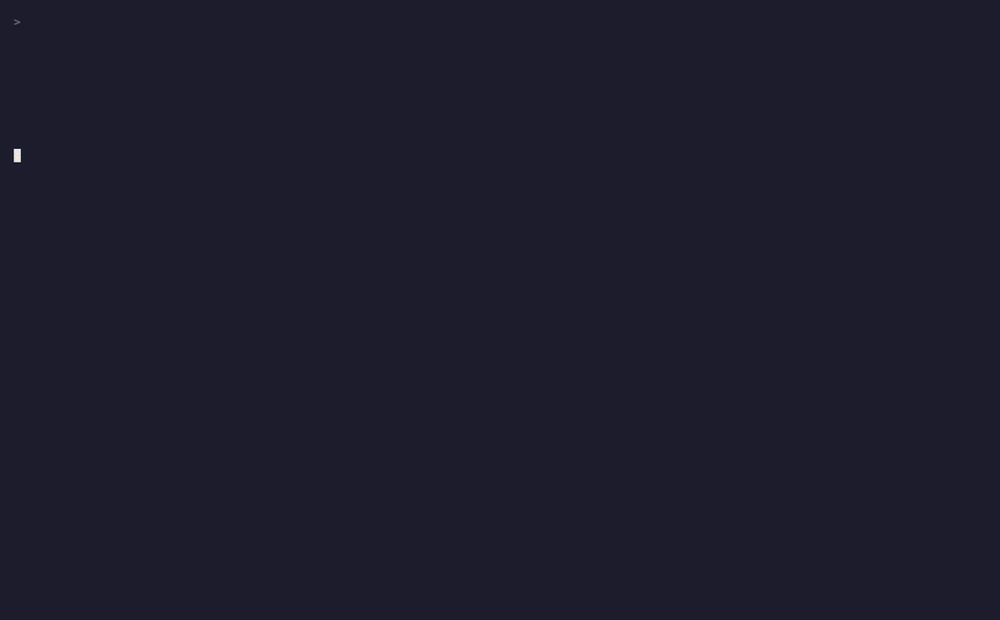

# MemoryGraph

> *Il processo del pensiero, reso permanente.*

<p align="center">
  
</p>

La maggior parte di ciò che i ricercatori imparano davvero non viene mai registrata.
L'ipotesi fallita alle 23. Il cambio di rotta dopo un'osservazione sbagliata.
Il vicolo cieco che ha richiesto tre settimane — e avrebbe risparmiato tre mesi alla persona successiva.

Questa conoscenza scompare. Non perché le persone non vogliano preservarla.
Ma perché ogni sistema esistente richiede un atto di volontà aggiuntivo per farlo.

**MemoryGraph la cattura automaticamente — come effetto collaterale del pensiero, non come lavoro extra.**

---

## L'idea centrale

Ogni unità di pensiero vive come nodo in un grafo di conoscenza personale.
Osservazioni, ipotesi, conclusioni, vicoli ciechi, domande aperte.
Ogni nodo porta con sé una storia temporale completa — ogni cambiamento di credenza, ogni svolta, ogni momento in cui la fiducia è cambiata e perché.

Il grafo non è mai uno snapshot. **È una registrazione.**

Quando due ricercatori devono condividere conoscenza, non scrivono un documento e non fissano una riunione.
Uno emette un **subgraph token** firmato — una selezione precisa di nodi — verso l'altro.
Il destinatario riceve un fork isolato. Lo sviluppa liberamente.
Se scopre qualcosa di prezioso, propone un merge.
L'agente del mittente analizza il delta semantico prima che un umano approvi.

Questo è **Git per la conoscenza**. Non come metafora. Come architettura.

| Git | MemoryGraph |
|---|---|
| Repository | Grafo di conoscenza personale |
| Commit | NodeState — una credenza catturata in un momento nel tempo |
| Fork | SubgraphToken — una copia firmata di nodi selezionati |
| Diff | Delta semantico tra due traiettorie di nodi |
| Pull request | MergeProposal — con rilevamento dei conflitti |
| Merge conflict | Nodi con traiettorie di fiducia contraddittorie |

---

## Perché questo è importante

> **100 miliardi di dollari** vengono sprecati ogni anno in duplicazione della ricerca per mancata condivisione dei risultati negativi.
> **L'85%** dei fondi di ricerca va perso in parte per la pubblicazione selettiva di dati negativi.
> **~0** strumenti esistenti catturano il *processo* di ricerca senza richiedere sforzo aggiuntivo.

Ogni tentativo di risolvere questo problema è fallito per la stessa ragione:
richiedono un atto deliberato e postumo di pubblicazione.
Più lavoro. Nessuna ricompensa. Nessuna adozione.

MemoryGraph elimina l'atto del tutto.
La conoscenza viene catturata **durante** il processo, non dopo.
I vicoli ciechi diventano dati di prima classe. La materia oscura della ricerca ha finalmente un posto dove esistere.

---

## Principi di design

**Nessun punto di buio.**
Ogni cambiamento di credenza, ogni esperimento fallito, ogni momento di dubbio è un dato.
La traiettoria del pensiero è preziosa quanto la destinazione.

**Il consenso è granulare e revocabile.**
Nessun accesso senza un token esplicito e firmato.
Condividere un sottografo non espone mai il grafo completo.
Ogni token ha un emittente, un destinatario, un perimetro e una scadenza.

**L'agente suggerisce. L'umano decide.**
Il Memory Agent osserva e aggiorna il grafo in modo continuo.
Può proporre un match, segnalare un conflitto, suggerire un merge.
Non agisce mai senza approvazione.

**Niente viene mai cancellato.**
Nodi e archi vengono invalidati con un timestamp, mai rimossi.
La storia del grafo è immutabile. Si può sempre tornare indietro.

---

## Architettura

Quattro layer. Ognuno con una singola responsabilità.

```
┌─────────────────────────────────────────────────────┐
│  L4 — Fork / Merge Engine                           │
│  SubgraphToken · MergeProposal · diff semantico     │
├─────────────────────────────────────────────────────┤
│  L3 — Auth & Consent Layer                          │
│  token firmati · scadenza · revoca · UserConsent    │
├─────────────────────────────────────────────────────┤
│  L2 — Memory Agent                                  │
│  estrazione entità · quality gate · pattern detect  │
├─────────────────────────────────────────────────────┤
│  L1 — Graph Store                                   │
│  Kuzu (embedded) · multi-tenant · append-only       │
└─────────────────────────────────────────────────────┘
```

**Graph Store** — Il primitivo di dato principale. Ogni utente possiede un sottografo isolato.
I nodi sono unità epistemiche tipizzate. Gli archi sono relazioni tipizzate. Niente viene mai cancellato.
Consigliato: [Kuzu](https://kuzudb.com/) per il prototipo; Neo4j o FalkorDB per la scala.

**Memory Agent** — Osserva il flusso di input dell'utente e aggiorna continuamente il grafo.
Estrae entità, crea nodi, rileva contraddizioni.
Applica un quality gate prima di ogni scrittura — non tutto appartiene al grafo.
LLM-agnostico: funziona con qualsiasi modello tramite prompting strutturato.

**Auth & Consent Layer** — Ogni operazione di condivisione produce un `SubgraphToken`.
Un oggetto firmato che elenca esattamente quali nodi vengono condivisi, con quali permessi, con quale scadenza.
Nessun accesso senza token valido. Il consenso è esplicito, granulare, revocabile.

**Fork / Merge Engine** — La condivisione produce una copia isolata, mai una vista live.
Il destinatario sviluppa il fork liberamente.
`MergeProposal` presenta un diff semantico prima che un umano approvi l'integrazione.

---

## Schema

```python
# L'unità fondamentale di credenza
NodeEntity:
  id              UUID
  user_id         UUID        # isolamento multi-tenant
  type            ENUM        # Observation | Hypothesis | Conclusion
                              # DeadEnd | OpenQuestion | Paper
                              # Experiment | MethodDecision
  created_at      TIMESTAMP
  is_deleted      BOOL        # soft delete — la storia è immutabile

# Una riga per ogni cambiamento di credenza
NodeState:
  id              UUID
  node_id         UUID        # → NodeEntity
  version         INT         # incrementale da 1
  content         TEXT
  confidence      FLOAT       # 0.0 → 1.0 — il segnale centrale
  trigger         TEXT        # "perché è cambiato questo?"
  created_at      TIMESTAMP   # questo È il timestamp di evoluzione

# Relazioni tipizzate tra nodi
Edge:
  from_node       UUID
  to_node         UUID
  type            ENUM        # supporta | contraddice | deriva_da
                              # falsifica | apre_domanda | risolve
  confidence      FLOAT       # anche gli archi portano certezza
  invalidated_at  TIMESTAMP   # null se ancora valido — non si cancella

# L'unità di condivisione consensuale
SubgraphToken:
  issuer_id       UUID
  recipient_id    UUID
  node_ids        JSONB       # [{id, include_history: bool}]
  forkable        BOOL
  expires_at      TIMESTAMP
  signature       TEXT        # hash di integrità

# Primitivo per il pattern matching cross-grafo
TrajectoryPattern:
  node_id         UUID
  pattern_type    ENUM        # consolidating | collapsing | recovered
                              # oscillating | terminal_deadend
  context_hash    TEXT        # embedding semantico per il matching cross-utente
  computed_at     TIMESTAMP

# Consenso dell'utente per la partecipazione alla rete
UserNetworkConsent:
  discoverable    BOOL        # il mio grafo è ricercabile dalla rete?
  share_deadends  BOOL        # includo le traiettorie fallite nei match?
  share_triggers  BOOL        # condivido il testo del "perché"?
  auto_propose    BOOL        # l'agente può proporre match in autonomia?
```

---

## Casi d'uso

### UC-01 — Due ricercatori, un vicolo cieco

Anna studia il meccanismo di legame delle proteine virali. Bruno studia la risposta immunitaria.
L'ipotesi di Anna si è costruita per tre settimane — fiducia in crescita fino a 0.7.
Poi un nuovo esperimento. La fiducia scende a 0.2. Pattern: `collapsing`.

Il suo Memory Agent cerca nella rete nodi con contenuto semantico simile
e pattern type `recovered` — qualcuno che ha avuto lo stesso problema e ne è uscito.
Il grafo di Bruno ha esattamente questo. Trigger: *"corretto errore nel calcolo del pH"*.

L'agente propone. Anna approva.
Viene emesso un SubgraphToken che copre solo i nodi rilevanti di Bruno.
Il grafo completo di Bruno non viene mai esposto.
Anna riceve un fork. Lo sviluppa. Se trova qualcosa di nuovo, propone un merge.

**La materia oscura della ricerca di Bruno risparmia tre settimane ad Anna.**

---

### UC-02 — Il ricercatore solitario

Nessun collaboratore. Nessuna rete ancora. Il sistema è comunque utile.

Mentre il ricercatore lavora — leggendo, annotando, sperimentando —
il grafo si costruisce da solo. Ogni ipotesi ottiene un NodeState.
Ogni svolta ottiene un trigger.

*"Mostrami come si è evoluta la mia fiducia nell'ipotesi X nelle ultime 8 settimane."*

Il sistema ricostruisce la traiettoria completa — inclusi i vicoli ciechi
che non erano mai stati scritti da nessuna parte.
Il ricercatore può viaggiare nel tempo attraverso il proprio pensiero.

---

### UC-03 — Il team di laboratorio

Cinque ricercatori. Stesso progetto. Percorsi paralleli.
I grafi non si fondono — l'autonomia è preservata.

Il sistema rileva quando due ricercatori si stanno avvicinando alla stessa ipotesi
da angoli diversi e invia un segnale: *"Il ricercatore C potrebbe stare lavorando su qualcosa di correlato."*
Nessun contenuto esposto. Solo un segnale.

Quando un ricercatore raggiunge una conclusione che contraddice l'ipotesi attuale di un altro,
entrambi vengono avvisati. Nessun grafo viene modificato. Gli umani decidono come procedere.

---

### UC-04 — Il momento del paper

Mesi di ricerca. È il momento di scrivere.

Il grafo contiene già l'arco narrativo completo —
ogni svolta, ogni vicolo cieco, ogni momento in cui la fiducia è cambiata e perché.
L'agente ricostruisce la storia della ricerca in ordine cronologico.
I nodi `MethodDecision` diventano la sezione dei metodi.
I nodi `DeadEnd` diventano materiale supplementare strutturato.

**La materia oscura diventa dato pubblicato.**
Il prossimo ricercatore che colpisce lo stesso muro trova la via d'uscita.

---

## Roadmap

**Fase 1 — Fondamenta**
Graph store con Kuzu · NodeEntity + NodeState con versionamento completo ·
Invalidazione degli archi (nessuna cancellazione) · Isolamento multi-tenant · CLI di base

**Fase 2 — Memory Agent**
Estrazione di entità con LLM · Quality gate prima della scrittura nel grafo ·
Stima della fiducia dal linguaggio · Popolazione del trigger ·
Rilevamento delle contraddizioni

**Fase 3 — Protocollo di condivisione**
Generazione del SubgraphToken · Firma e scadenza ·
Fork import nel grafo isolato · UserNetworkConsent ·
REST API di base tra due istanze

**Fase 4 — Pattern matching**
Calcolo del TrajectoryPattern · Embedding semantici ·
Ricerca pattern cross-utente con verifica del consenso ·
MergeProposal con diff semantico ·
Suggerimenti di match da parte dell'agente

---

## Stack

- **Linguaggio**: Python
- **Database a grafo**: [Kuzu](https://kuzudb.com/) (embedded, prototipo) → Neo4j / FalkorDB (scala)
- **LLM**: agnostico — qualsiasi modello tramite prompting strutturato
- **Embedding**: qualsiasi provider o modello locale
- **Deployment**: VPS singolo o distribuito (un'istanza per utente)

---

## Come contribuire

Questo è un RFC aperto. L'architettura qui descritta è un punto di partenza, non una risposta definitiva.

Cerchiamo persone che vogliano:

- **Costruire** — implementare qualsiasi fase della roadmap
- **Criticare** — aprire issue che sfidano il design, trovare i punti di fallimento
- **Estendere** — adattatori di dominio (quaderni di laboratorio, ricerca clinica, ingegneria del software, ricerca legale)
- **Ricercare** — classificazione migliore delle traiettorie, ricerca cross-grafo privacy-preserving, protocolli di consenso

Aree in cui il design è esplicitamente aperto:

| Area | Domande aperte |
|---|---|
| Architettura del grafo | Alternative a Kuzu? Miglioramenti allo schema? |
| Memory Agent | Design migliore del quality gate? Strategie di stima della fiducia? |
| Protocollo di consenso | Rafforzamento crittografico? Modellazione GDPR? Revoca? |
| Pattern matching | Classificazione traiettorie senza esporre il contenuto grezzo? |
| Cold start | Come rendere utile il grafo di un singolo utente prima che la rete esista? |

Apri una issue. Forka la repo. Rompi il design.
**L'obiettivo non è il consenso — è il sistema migliore possibile.**

Tutti i contributor devono firmare il Contributor License Agreement prima che la pull request venga accettata.

---

## La convinzione alla base di questo progetto

La scienza accumula conoscenza attraverso i risultati pubblicati.
Ma i risultati pubblicati sono il 10% finale di ciò che è stato davvero imparato.
L'altro 90% — i percorsi falliti, le svolte, le intuizioni che non hanno funzionato —
scompare in quaderni di laboratorio che nessuno legge, o da nessuna parte.

Questo non è un problema di documentazione. È un problema di infrastruttura.
Non esiste infrastruttura per il processo del pensiero in sé.

MemoryGraph è un tentativo di costruire quella infrastruttura.
Non chiedendo ai ricercatori di fare più lavoro.
Facendo sì che il lavoro che già fanno lasci una traccia permanente e condivisibile.

---

*RFC v0.1 — Maggio 2026 — AGPL-3.0*
